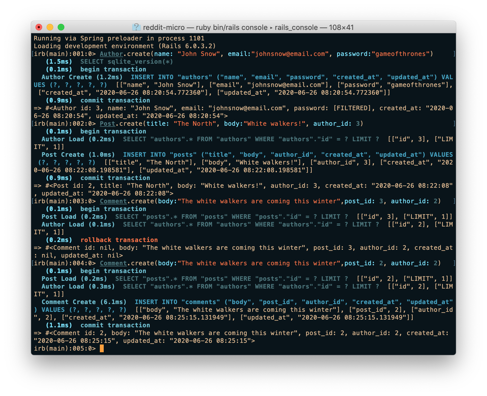

<br />
<p align="center">
  <a href="https://www.microverse.org/">
    
  </a>

  <h2 align="center">Building with Active Record</h2>

  <p align="center">
    This project is part of the Microverse curriculum in Ruby on Rails module!
  </p>
</p>

## About The Project

This project we created a junior version [Reddit](https://www.reddit.com/) called micro-reddit, it is based on active record models, a user can create a post or create a comment of the post, it is running using the terminal, no user interface yet.




<!-- INSTALLATION -->
## Installation

You need to have this app or tools to start using it:
* [Ruby](https://www.ruby-lang.org/en/downloads/)
* [Rails](https://rubyonrails.org/): better to have rails version 2.6.5.
* clone this repo ```git clone https://github.com/rindrajosia/micro-redit.git```
* cd to the cloned folder and open with the terminal and run ```bundle install```
* After all the [gems](https://rubygems.org/) type ```rake db:migrate```
* Then type ```rails console```

### Usage

Once you have started the console you will be able to work with the assocs: for `Author`, `Post` and `Comment` 

### Examples:

- Creating Author: `Author.create(name: "put your name here", email:"email here", password:"set pass here ")`
- Creating post: `Post.create(title: "title here", body:"body here", author_id: author_id)`
- Creating comment: `Comment.create(body:"body of comment",post_id:post_id, author_id: author_id )`

## Test your outputs create two authors, 1 post and 1 comment:
- `u2 = author.find(2)`
- `c1 = u2.comments.first should return that author’s comment. #comments returns an array with comments, which is why we need to use #first to actually retrieve the comment itself.`
- `c1.author should return that comment’s author (u2).`
- `p1 = Post.first`
- `p1.comments.first should return the comment c1.`
- `c1.post should return the post p1.`

### Built With

* [Ruby](https://www.ruby-lang.org/en/downloads/)
* [Rails](https://rubyonrails.org/):
* [Rubocop](https://github.com/rubocop-hq/rubocop)
* [Stickler](https://stickler-ci.com/)

## Authors

👤 **Edie Atha**

- Github: [@edieatha](https://github.com/edieatha)
- Twitter: [@edieatha](https://twitter.com/edieatha)
- Linkedin: [linkedin](https://www.linkedin.com/in/edieatha/)
 Email: [email](edieatha@gmail.com)

👤 **Joseph Mindo**

- Github: [@MindoJoseph](https://github.com/Mindo-Joseph)
- Twitter: [@mindoJoseph](https://twitter.com/mindoJoseph)
- Linkedin: [Joseph Mindo](https://www.linkedin.com/in/joseph-mindo-367284132/)


## 🤝 Contributing

Contributions, issues and feature requests are welcome!

Feel free to check the [issues page](https://github.com/Mindo-Joseph/reddit-micro/issues).


## Acknowledgments

* [Microverse](https://www.microverse.org/)
* [The Odin Project](https://www.theodinproject.com/)


## 📝 License

This project is [MIT](lic.url) licensed.


## Show your support

Give a ⭐️ if you like this project!

